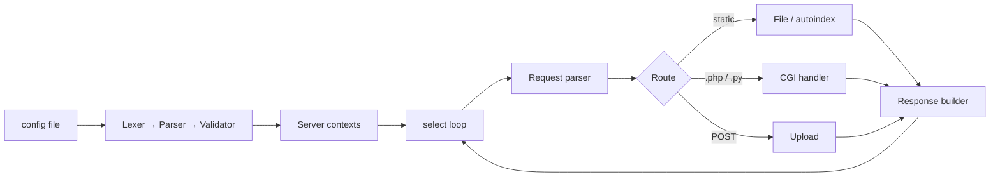

# Webserv — an HTTP/1.1 server in C++98

A non-blocking HTTP server written from scratch in C++98, with nginx-style configuration, CGI, file uploads and multiple virtual servers. It was built as a team project at 1337 (42 Network) with [@sickl8](https://github.com/sickl8), [@Chegashi](https://github.com/Chegashi) and [@nassimabb](https://github.com/nassimabb).

## Features

- **Single-threaded I/O multiplexing** with `select()` across all listening and client sockets. Nothing blocks.
- **Methods:** `GET`, `POST` (including file upload) and `DELETE`.
- **nginx-style config:** several `server` blocks, `listen`, `server_names`, `root`, `index`, `autoindex`, `allow_methods`, `client_max_body_size`, `upload_path`, `return` redirects, and per-`location` overrides.
- **CGI** for `.php` and `.py` scripts, configurable per location.
- **Custom error pages** for 301, 400, 403, 404, 405, 413, 414, 500 and 501.
- **Config parser** with separate lexical, parsing and logical error reporting (`config/`).

## Architecture



| Folder | Responsibility |
|---|---|
| `config/` | Tokenizer, parser and validation of the nginx-like config |
| `networking/elements/` | Socket setup and the `select()` event loop |
| `networking/request/` | HTTP request parsing (headers, chunked body) |
| `networking/response/` | Status codes, headers, static files, autoindex |
| `networking/cgi/` | CGI environment and process handling |

## Run it

```bash
git clone https://github.com/Alcheemiist/42_Cursus_webserv.git
cd 42_Cursus_webserv
make
./webserv test.conf        # then open http://localhost
```

Example config:

```nginx
http {
    server {
        listen 0.0.0.0:8081;
        root ./www;
        allow_methods GET POST;
        location /post {
            upload_path ./www/upload;
            client_max_body_size 214009;
            cgi .py { cgi_path /usr/bin/python3; allow_methods GET POST; }
        }
    }
}
```

---

Built by [Elmahdi Elaazmi](https://elaazmielmahdi.com) and team · 1337 / 42 Network core curriculum.
